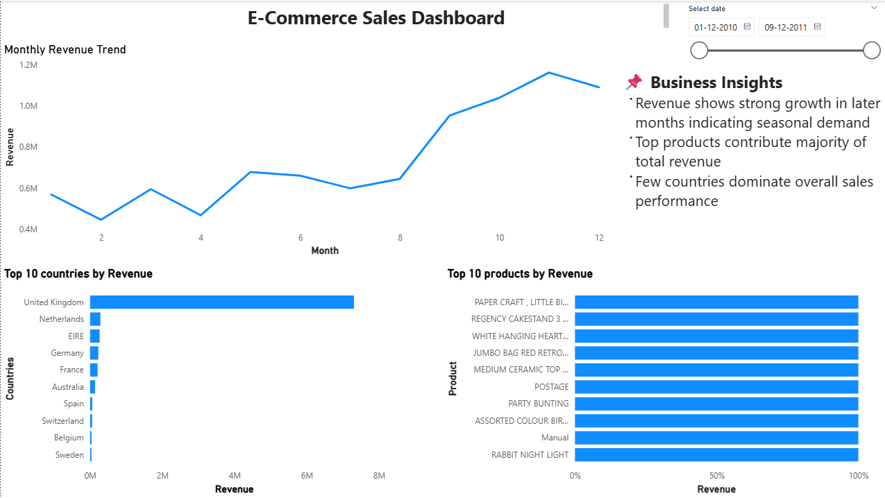
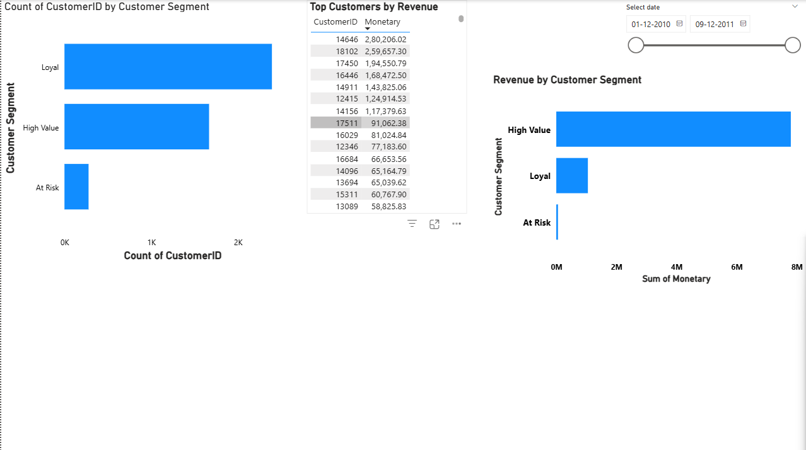

## 📊 Dashboard Preview

### Page 1

### Page 2

## 📌 Project Overview
This project analyzes e-commerce data to uncover insights related to sales performance, customer behavior, and product trends.

## 🛠️ Tools Used
- Python (Pandas)
- Power BI
- Excel

## 📊 Key Insights
- Revenue shows seasonal trends across months
- Top products contribute major share of revenue
- Few countries dominate sales
- High-value customers generate most revenue

## 📂 Files Included
- Power BI Dashboard (.pbix)
- Dataset (CSV)
- Python Notebook
